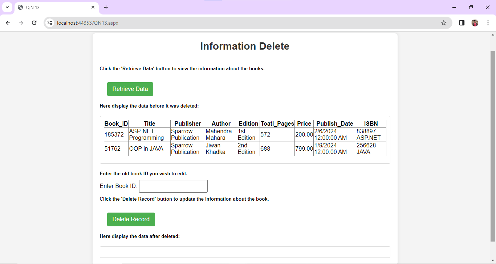

# Books Data Removal Server-Side Script

This repository contains the server-side script for removing books data stored from the previous question (Question No. 12).



## Getting Started

To get started with this program, follow these steps:

1. Clone this repository to your local machine:
   ```bash
   git clone https://github.com/Krishprajapati15/dotnet.git
   ```
2. Navigate to the project directory:
   ```bash
   cd dotnet
   ```
3. Ensure you have the necessary dependencies installed.
4. Run the server-side program using your preferred environment or IDE.
5. Access the books data removal form through the provided URL.

## Dependencies

Make sure you have the following dependencies installed:

- [ASP.NET](https://dotnet.microsoft.com/apps/aspnet) - Web framework for building modern web apps and services with .NET
- [C#](https://docs.microsoft.com/en-us/dotnet/csharp/) - Modern, general-purpose programming language
- [HTML](https://developer.mozilla.org/en-US/docs/Web/HTML) - Standard markup language for creating web pages
- [CSS](https://developer.mozilla.org/en-US/docs/Web/CSS) - Style sheet language used for describing the presentation of a document written in HTML
- [MySQL Database Management System](https://www.mysql.com/) - Open-source relational database management system.

## Books Data Removal

The server-side script provides functionalities to remove books data stored in the database. This may include:

1. **Deleting Specific Records**: Remove specific book entries based on unique identifiers such as `id` or `ISBN`.
2. **Clearing the Database**: Optionally, provide functionality to clear the entire books database.

## Contributing

If you'd like to contribute to this project, please follow these guidelines:

1. Fork the repository:
   ```bash
   git fork https://github.com/Krishprajapati15/dotnet.git
   ```
2. Create your feature branch:
   ```bash
   git checkout -b feature/YourFeatureName
   ```
3. Commit your changes:
   ```bash
   git commit -am 'Add some feature'
   ```
4. Push to the branch:
   ```bash
   git push origin feature/YourFeatureName
   ```
5. Create a new Pull Request.

## License

This project is licensed under the [MIT License](MIT-LICENSE). This means the project is free for anyone to clone or use for their own projects.

## Contact

For any questions or suggestions, feel free to contact me:

- **GitHub**: [Krishprajapati15](https://github.com/Krishprajapati15)
